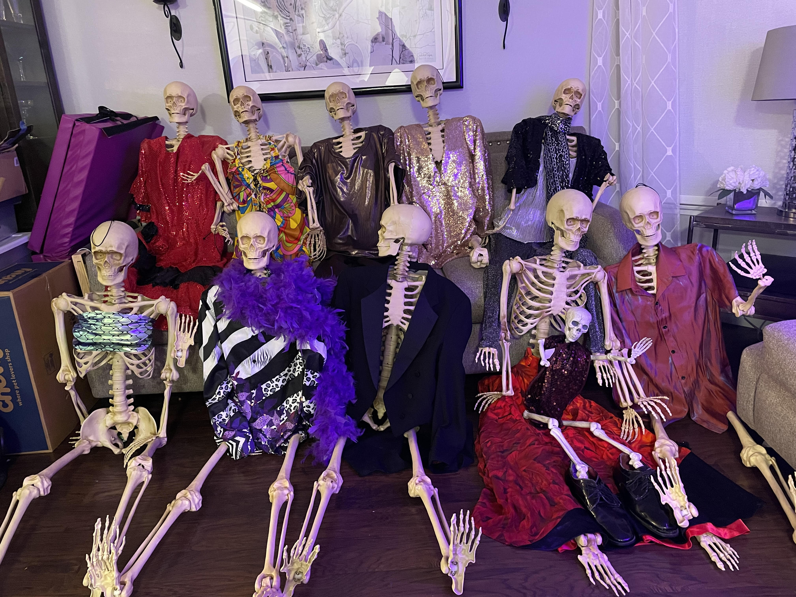

# SKELEYES
This is just a simple hobbyist script that helped synchronize the strobe lights and the skeleton led eyes in our yearly Halloween display.  This particular year we went for a disco dance theme, hence the chart represents 'Stayin Alive' by the Bee Jees :)

Convert a song into a simple json peak map for our raspberry pi to flicker eyes on plastic skeletons.  It's not going to be a perfect frequency map as the goal is to flicker the eyes by adjusting the brightness without turning them off.  The Raspbery Pi will be controlling a handful of 12v 'Eagle Eye LEDs'.  

This is just meant for fun halloween props at the house.  It has no real purpose other than adjusting the brightness levels for the eyes on some of the props in our front yard while playing music at the same time.  If anyone else finds it usefull, I'll be pleasantly suprised :)

# Simple JSON Map
For simplicity, just output the (time, brightness) to a JSON file.    In this example we are controlling the brightness at the 1/10th of a second intervals which is ... fast for a long song
```
{
  "0": 0,
  "0.1": 100,
  "0.2": 100,
  "0.3": 95,
  "0.4": 74,
  "0.5": 80,
  "0.6": 78,
  "0.7": 83,
  "0.8": 89,
  "0.9": 81,
  "1.0": 84,
  "1.1": 92,
  "1.2": 89,
  "1.3": 85,
  "1.4": 85,
  "1.5": 78,
  "1.6": 83,
  "1.7": 85,
  "1.8": 83,
  "1.9": 86,
```

# Example Flicker Map for 'Stayin Alive' by the Bee Jees!

